# Smart Speaker Configuration Guide

Make sure your device either has the latest SUSI Smart Speaker Image or you ran the install.sh from susi_installer on your device prior to this guide.

This guide is for setting up the smart speaker according to your environment. There are two ways to do this
- Setting up the smart speaker with the SUSI AI android app.
- Setting up the smart speaker using the web interface.

## Configuring the smart speaker using the Android app

* Download the Android app either from the [playstore](https://play.google.com/store/apps/details?id=ai.susi) or from [Github](https://github.com/fossasia/susi_android/tree/apk).

* Open up the android app to see a screen like this. Login to your account or register a new one.

  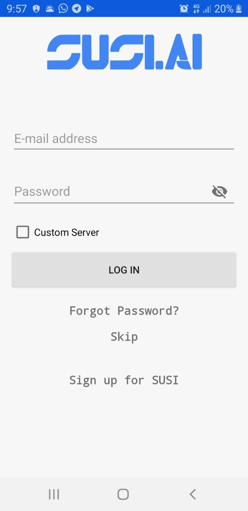 

* After logging in you'll see the main screen of the app. click on the blue circle icon with SUSI logo on it.

  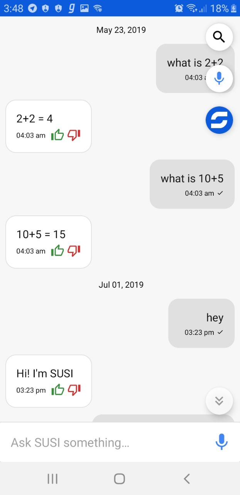 

* Now You'll see the SUSI skills page, click on the three dots on the top right corner of the screen and select settings.

   

* Scroll Down to the devices section. And click on `click here to move to the device setup screen`.

  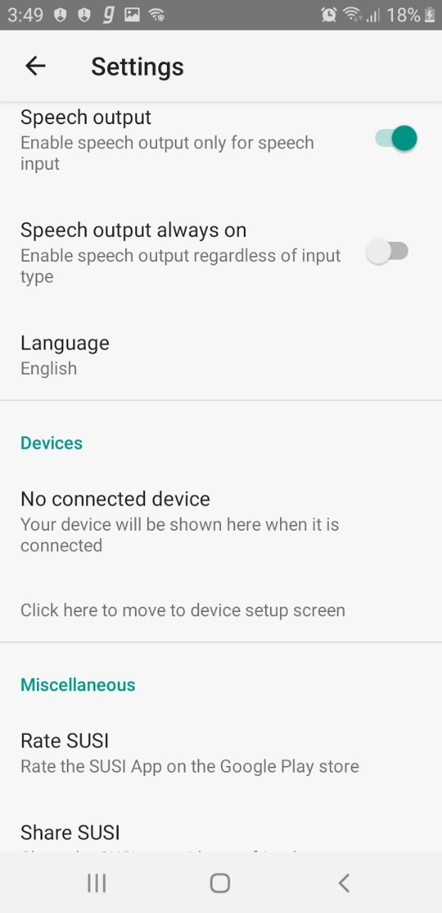 

* Make sure your device is Turned on. The Smart Speaker will appear on the screen only if it is in Access Point mode. The Device is by default in access point mode if it has not been set up before. If you want to reconfigure the device, click on the reset button for ~7 seconds until you hear a beep sound, wait for the process to finish and your speaker will pop up on the screen as shown.

  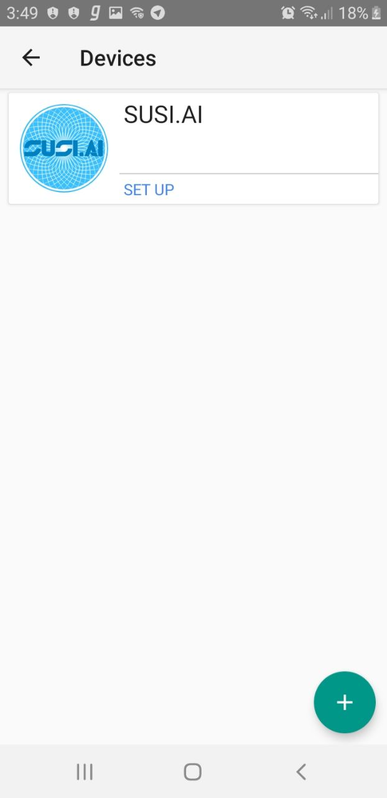 

* Select the WIFI SSID you want your smart speaker to be connected to. Enter the password to your WIFI and enter the password to your SUSI AI account.

  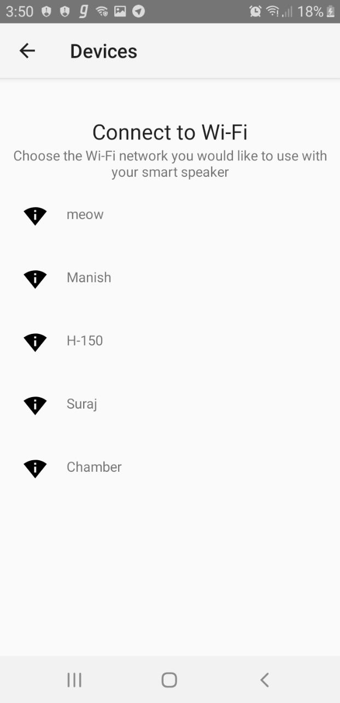 

* Your Device is configured successfully. Wait for the process to finish up. You'll hear `SUSI has started` and the three lights on the ReSpeaker hat will light up.

  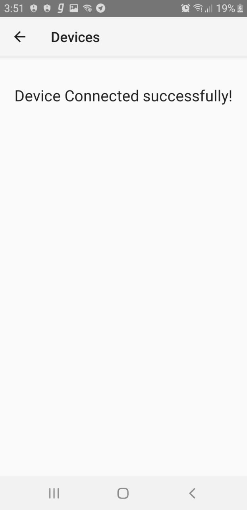 

## Configuring the smart speaker using the web client.

* This method can be used to set up the smart speaker without the need of installing the SUSI Android app. The Smart Speaker creates its own WIFI access point with the SSID - `SUSI.AI`. The Device is by default in access point mode if it has not been set up before.

* Open the wifi menu and connect to your Smart Speaker's access point named "SUSI.AI".

  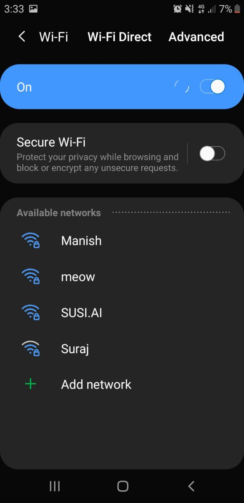 

* Then enter the password -  `password`

  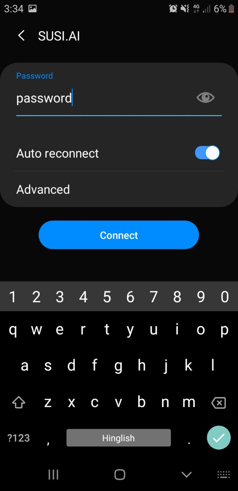 

* Now you should be connected to the WIFI network created by the Smart Speaker.

  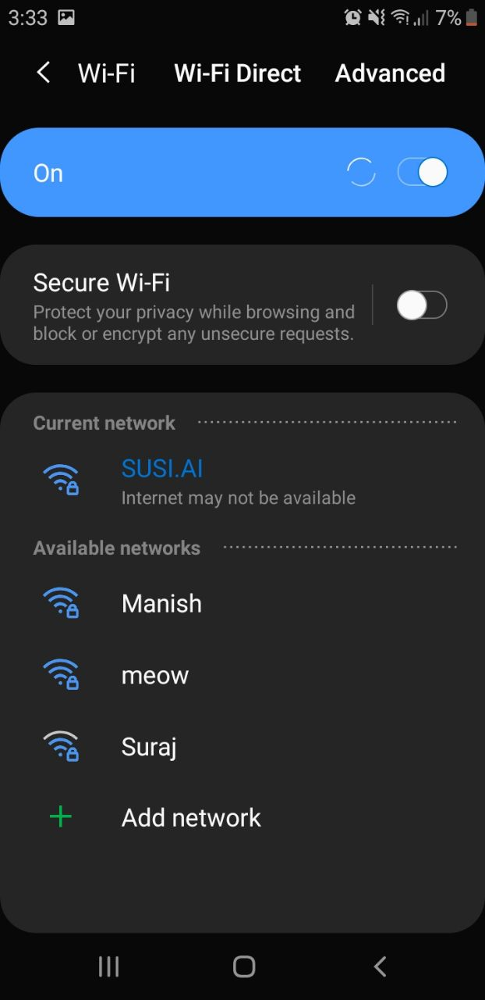 

* Open up a web browser and enter the URL - http://10.0.0.1:7070. You'll see the following page-

  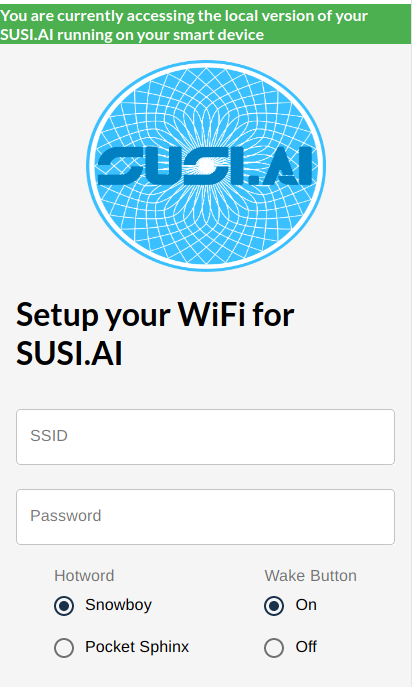 

* Enter the WIFI SSID you want your smart speaker to be connected to.
Then Enter the password to your WIFI.  

  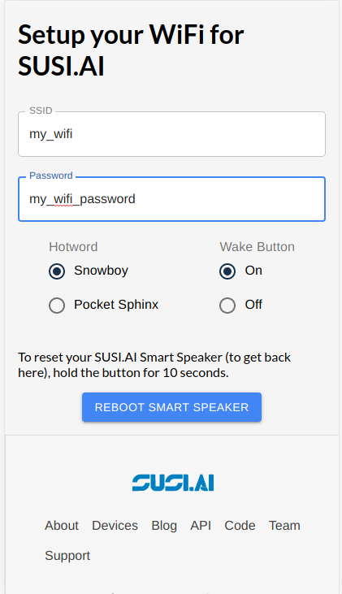 

* Select the Hotword engine and Select if you want to enable button support(included on the Respeaker PiHat).\
Select Reboot Smart Speaker.

#### The speaker should now reboot. If everything is set-up correctly, you'll hear "SUSI has started" sound and the three LED lights on the Respeaker Pi-Hat will light up.
